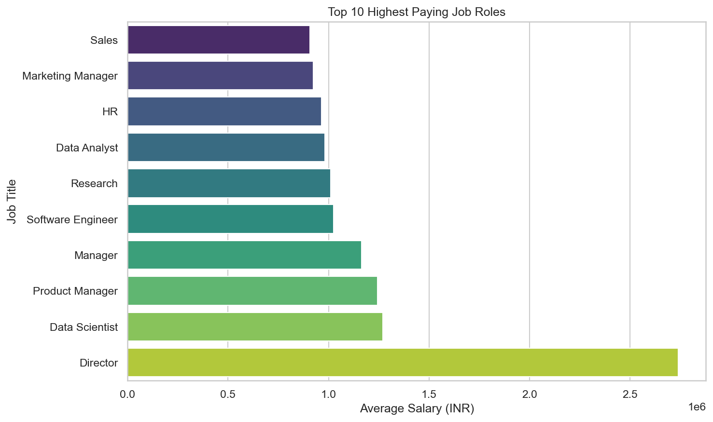
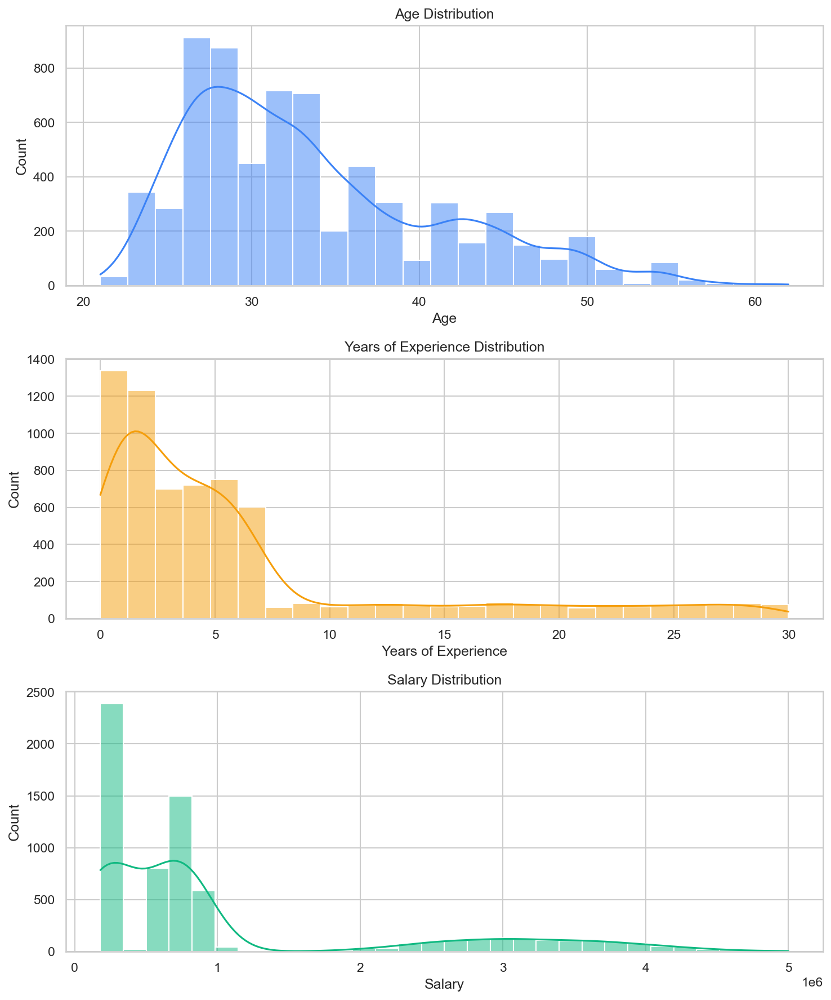
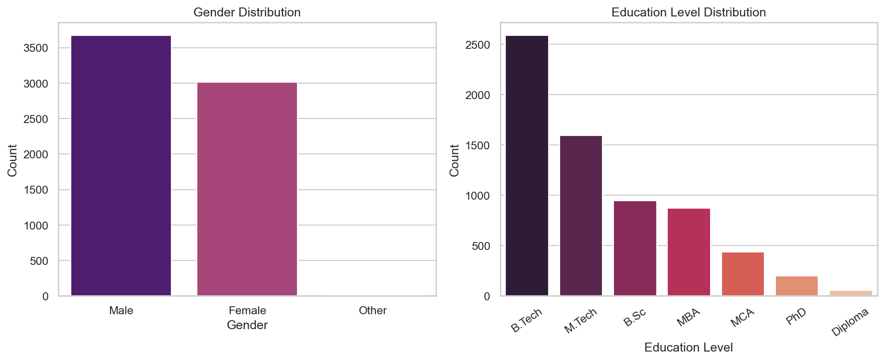
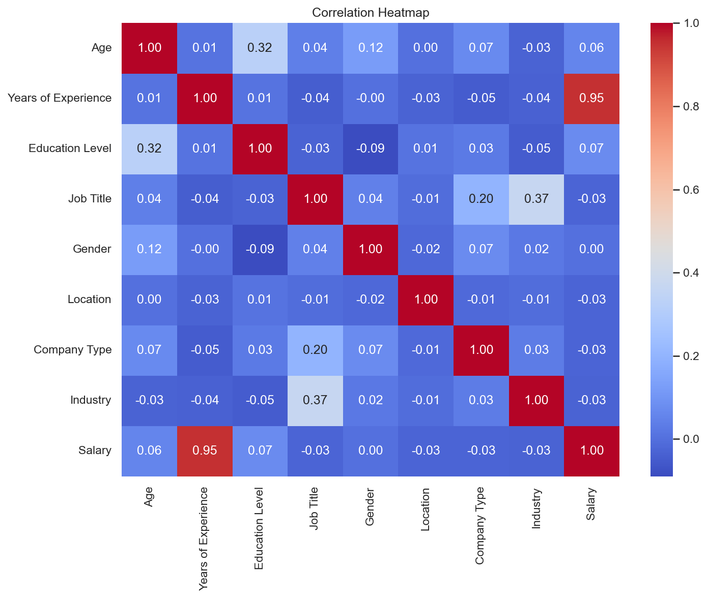
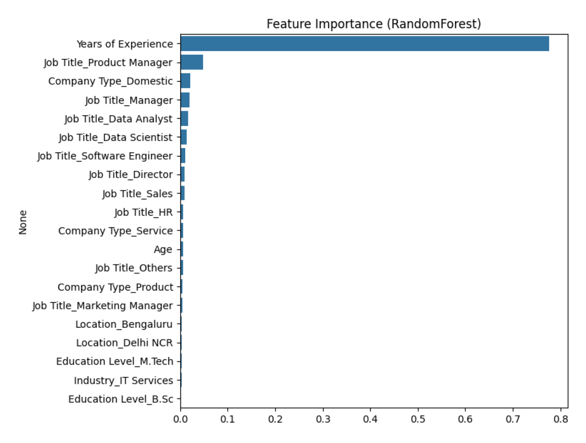

# Salary Prediction

## Introduction
This project aims to predict salaries based on various factors, such as age, gender, education level, job title, and years of experience. We have used a dataset containing 6704 rows and 6 columns to develop and evaluate our salary prediction model.

## Data Preprocessing

### Handling Missing Values
We checked for missing values in the dataset and removed rows with missing data, ensuring a clean dataset for modeling.

## Data Visualization


### Top 10 Highest Earning Professions

*A Bar plot depicting the highest paying job titles versus the mean salary.*

### Distribution of Continuous Variables

*This histogram shows the distribution of continuous variables in the dataset.*

### Distribution of Education and Gender

*A plot displaying the Education Level and Gender.*

### Correlation Heatmap

*A heatmap illustrating the correlation between different features.*

## Model Building and Evaluation

### Model Selection
We explored various machine learning algorithms, including Linear Regression, Decision Trees, and Random Forests, to build our salary prediction model. Hyperparameter tuning was performed using GridSearchCV to find the best model configuration.

### Model Evaluation

Each model's performance was evaluated using several regression metrics, including Mean Squared Error (MSE), Mean Absolute Error (MAE), Root Mean Squared Error (RMSE), and R-squared (R2) score. These metrics help assess the accuracy and reliability of the predictions.

### Feature Importance

*A bar chart depicting the importance of different features in predicting salary.*

## Results

1. The Random Forest model achieved the highest R-squared score and the lowest error metrics (MSE, MAE, RMSE), indicating superior predictive performance compared to the other models.
2. The Decision Tree model also performed well but had higher errors than the Random Forest.
3. The Linear Regression model, while simple, had the lowest R-squared score and the highest errors, suggesting limitations in capturing complex relationships.

## Conclusion

In conclusion, the Random Forest model demonstrated the best predictive capability for salary estimation in this dataset. Its feature importance analysis revealed the most influential factors.

The model evaluation and feature importance analysis provided valuable insights for understanding salary determinants and highlighted the importance of choosing the appropriate machine learning model for regression tasks.

This salary prediction model can be used to make informed salary estimates based on individual characteristics, making it a valuable tool for HR analytics and compensation planning.In conclusion, our salary prediction model, trained on a well-preprocessed dataset, successfully predicts salaries based on various factors. This project demonstrates the importance of data preprocessing, feature engineering, and model selection in creating an accurate predictive model.

## Usage

Quick start (train & run Streamlit app):

1. Create a Python environment and install dependencies:

```bash
pip install -r requirements.txt
```

2. Train models and generate artifacts (this will also enhance the dataset and save it under `data/`):

```bash
python train.py
```

3. Run the Streamlit frontend:

```bash
streamlit run app.py
```

Artifacts produced:
- `data/enhanced_salary_data.csv` — enhanced INR-context dataset (keeps original columns)
- `model/best_model.pkl`, `model/scaler.pkl`, `model/encoder.pkl`, `model/columns.pkl`
- `plots/predicted_vs_actual.png`, `plots/feature_importance.png`, `plots/model_comparison.csv`

Notes:
- Salaries use INR (₹) per annum everywhere. The enhancement step preserves the original structure and values are adjusted realistically for the Indian job market.
- The pipeline uses One-Hot Encoding (handle_unknown='ignore') so the app safely handles unseen categories.


